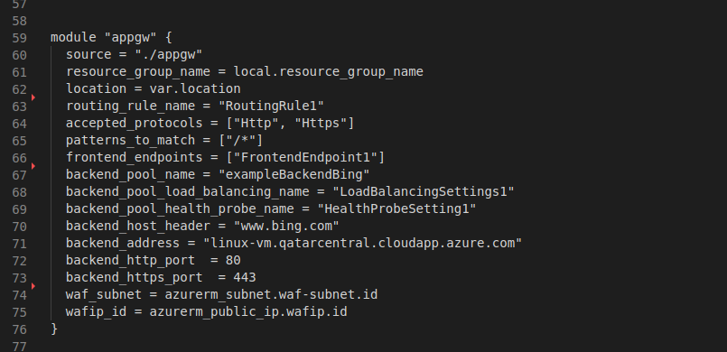

## This article provides information about how to use this repo to deploy a containerized stateless application.

This Terraform configuration deploys Kubernetes cluster on Azure to host the application. In addition to this, certain security measures are considered to secure the application as well as the infrastructure. A WAF is deployed to secure ME web application common attacks such as SQL injection, cross-site scripting XSS, and other attacks.

### How to use this repo: -

1. You should clone that repo and replace parameters as you wish.

2. You shall open the main configuration file (main.tf) in the root directory. Going through the content of the configuration file you will notice that it contains some variables that are common and it calls module for each service in Azure.

3. Replace the variable definitions that you see under each module as you see in the figure below.

4. It is that simple. Now what you need to do is just simply one this command:

`terraform init`

5. Running this command will download the providers needed to apply this configuration to the cloud service provider (CSP).
Now you can run this command:

`terraform apply -auto-approve`

6. Now you are all set.

### Notes:-

1. There is a module for creating a key vault that will contain the ssh key to connect to the virtual machine scale set (vmss), which are the nodes for Kubernetes cluster. 

2. Connecting to the virtual machines scale sets will be done through a service call to bastion to avoid deploying a public IP address and exposing port 22 to the internet. Bastion will enable the remote connection to them. Also note no username and password is used for the authentication to the machines, rather a more secure way includes ssh key.

3. The best practice to store the key is use a key vault. Hence, a key vault is created through the module kv and the ssh key is store in it. The permissions are given accordingly.
