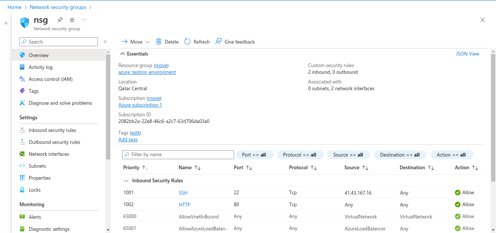
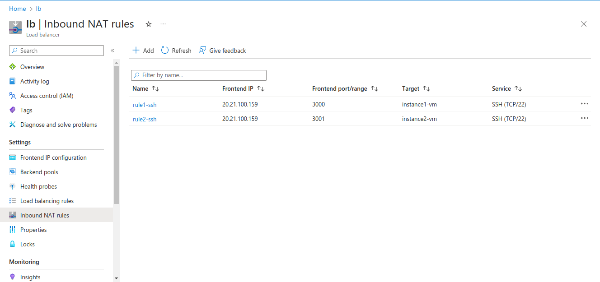
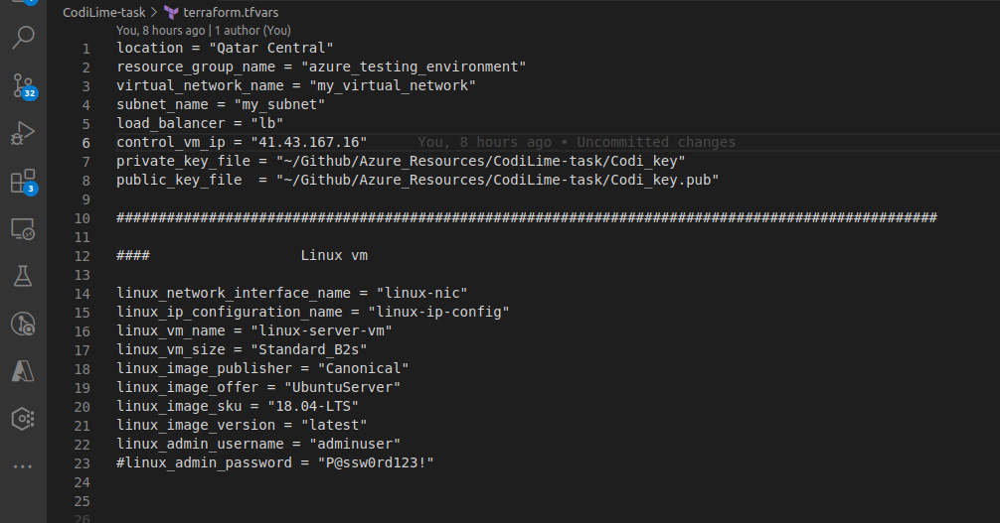
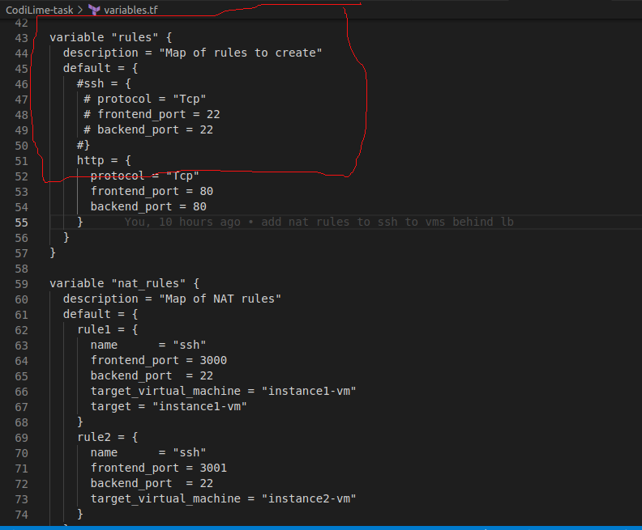

## Create a vm Linux machine to deploy a stateless containerized application

This repo contains Terraform file deploy a Linux virtual machine that can host a stateless containerized application using Docker. Through out this article, you will find explanation of the security measures taken through the creation of the whole environment through Terraform code. 

### Options of deployment

There are multiple choices of infrastructure to deploy this stateless containerized application. 

First, we can use virtual machines that will host the web application, normally LinuxOS would be used in that case. Of course, in that case we will have to take into consideration applying the security counter measures needed to prevent unauthorized access and this is the scope of this article.

Second option, is to deploy Kubernetes cluster, for example in Azure we will deploy AKS. Using this option, we will build a repository and push the containerized image of this application into it. After this, we will configure AKS to pull the image from the repo and deployed automatically on its nodes

### Deployment procedure

It all starts by creating Terraform file that contains the infrastructure. A good practice is not to use a one Terraform file because it will be so complex for maintenance or modifications. Hence we will create multiple Terraform files and name them with the component of the environment that they contain. Below will be the list of the Terraform files as described:

1. vm.tf
This file will contain one or in our case multiple virtual machine that will host the web application. Then that file are used [for_each] Terraform function avoid enlarging the file. This makes it easy to add other virtual machine to be used in another environment, for example.

I also wrote the Terraform code in a way to add as much variables as I can to make it very easy to change for example the name of the virtual machine, size of the vms, OS version, .. etc.

2. lb.tf
This file contains the configuration for the deployment of a load balancer in Azure. Also, I put as much variables as I could. Furthermore, the configuration of the load balancer such as the prompt to end configuration, the back-end pool, the load balancing rules, and the NAT rules are contained into the file so as just as it is created it will work automatically.

3. nsg.tf
This file is for the network security group which enforces the security of the virtual network that contains the virtual machines hosting the application. More explanation of this in the nsg section.

4. rg.tf
For the sake of simplicity, I separated the resource group with the provider in the Terraform into a separate file. Also, made as variable in order to change the location easily.

5. variables.tf
This file contains the declaration of the variables in the Terraform code, but not the exact value. 

6. variables.tfvar
This file contains the exact value I added such as the location of the resource group, size of the vms, ...etc.

Using such approach is quite important for the ease of modification of the code whether to add different resources or re-use the code to create a whole different environment.

## Security

### Using SSH key pair in stead of (username and password)

Although we can create a virtual machine using username and a password, this may put potential security risks because we hard code both username and password into the Terraform code. Normally, this is a bad practice and should never be done.

However, there are many workarounds to enforce security into that scenarios. One of those is to create a Vault in which we inserts the password of the virtual machine.

As we learn from the security professional, passwords are not the best in enforcing security. One method to add the new the risk is the usage of SSH keys. SSH key authentication is built upon public key infrastructure [PKI] to add a secure layer for authentication and that is the best way to authenticate to a linux-based virtual machine.

In the first comments in the repo, I used username and password and then I replaced the password with the usage of ssh key to add more security.

A file named tls.tf was created to create rsa keys that will be used as ssh keys in the authentication process using Terraform, however the best practice is to generate the rsa keys outside of Terraform. This means it will be done manually and add the key through Terraform file, and this is the case.

### NSG

In order to to secure access to the web application infrastructure, a network security group should be placed before the virtual machine. Network security groups do an imperative job which is filter all the traffic [inbound/outbound]. This can be done through the creation and modification of sg to allow or deny access to a certain protocol such as ssh, ftp, ...etc.

UTILIZATION (NSG) meets the objective of enforcing virtual network security for the web application hosting virtual machine. One of the things that network security groups do is limiting the access to virtual machines to a specific IP address which is the IP of the control machine. This means that even though someone could bypass the other security measures tries to connect to the machine will not be able to connect.

### Load balancer

One of the most significant security counter measures to consider when deploying the web application is to put the web application infrastructure, which in our case it is a virtual machine/multiple virtual machines, behind a load balancer. The load balancer has to important goals the first one is removing the public access to virtual machine and that is important. This means that the virtual machines will not have a public IP, hence there is no way to connect to them directly.

The second goal of deploying a load balancer is to/the traffic between multiple virtual machine instead of using only. Also, in case one of the virtual machines crashes the load balancer will route the traffic to the other virtual machine automatically, meaning no manual actions needed from DevOps engineer.

####  NAT rules

Those rules are very different from the load balancing rules.  The main difference between them is that load balancing rules do not differentiate between the virtual machines before routing the traffic to them, whereas the NAT rules gives us the ability to connect to a specific virtual machine behind the load balancer. Hence, these rule are created to be able to connect through ssh to each virtual machine on different ports.

As you can see from the figure below each virtual machine uses a different port. One machine uses port 3000 as the front-end port and the other uses port 3001. Those ports are the front-end ports of the load balancer which receives the traffic coming one of these ports and then transform that into port 22, the default port for ssh. This way the administrative port 22 is not exposed to the internet or public network which is an important security counter measure.

## Instructions

Now after going through the Terraform files, understanding the code now is the time to modify those files to give get the values that we want to have in our environment.

The developer will start by opening the variables.tfvar file to edit the values of the variables declared through Terraform file. As we can see from the image below those values can be changed to the values that we need. One example is important to take care of it which is the "control_vm_ip" variable, we can add the the value of the IP address of the machine that will have administrative access to those machine.

In addition, as mentioned above the best practice is to create the SSH key outside Terraform and then put the the path that contains those files [the key] as a variable as you can see in the below image:

Note: -
1. When creating the NAT rules from the beginning the "remote-exec" module will not work due to limitations of NAT rules.
NAT rules differ from load balancing rules. They are designed to give access to a specific machine behind the load balancer to be done manually, Hence, they reject/block the "remote-exec" module from installing docker service and running the docker container image automatically.

Creating a load balancing rule at the beginning using the Terraform code will utilize port 22. Therefore, when we try to create the NAT rules we will be faced with an issue because port 22 is already occupied with the load balancing so there is a conflict between load balancing rules and NAT rules. Hence, we will have to delete the load balancing group by removing them from the Terraform code and applying these changes again so the NAT rules will utilize port 22 at the back end.

While the back-end port is still the default one for SSH which is port 22, the front-end that will utilize are different as you can see from the image one machine is using port 3000 and another is using port 3001This is an important security counter measure when malicious attack or tries to ports can IP address they cannot find port 22 open so they don't know if the machine are Linux or not.

By hashing the load balancer from the Terraform file as we can see in the image below, and applying the changes using the command:

 ''terraform apply''

This will lead to deleting load balancer rules, and after that we can run the same command again to create the NAT

2. Load balancers in Azure cannot have virtual machines in the backend pool unless they belong to the same availability zone. So I create availability zone to make sure all the virtual machines that have to be created through Terraform or in the same availability zone. This is extremely important.

